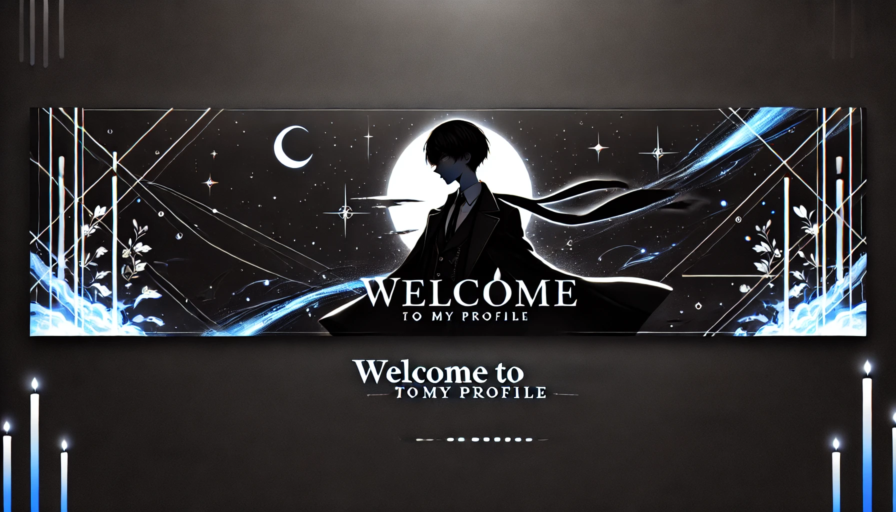
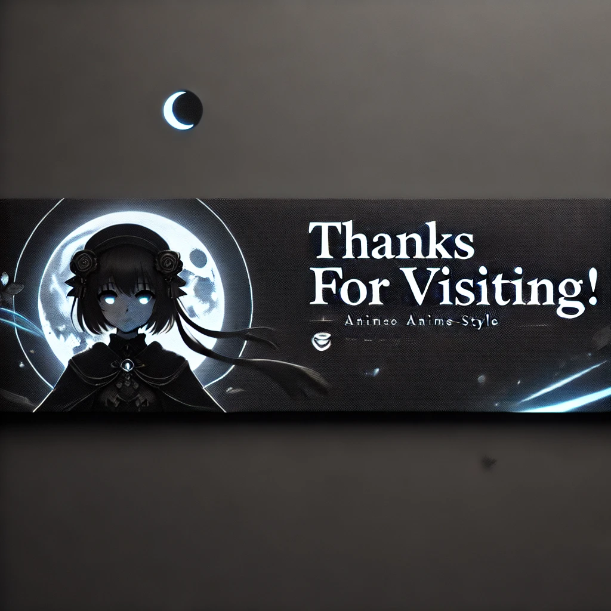

  

# 🎩 Welcome to My World of Logic & Creativity!  

### 👋 **Hi, I’m Phiwokwakhe Khathwane**  
A **problem-solver**, **software enthusiast**, and **creative thinker** passionate about crafting innovative solutions with **algorithms**, **data structures**, and **mathematical modeling**.

---

### 🧠 **About Me**  
I blend **logic and creativity** to build elegant systems. From **console apps** to **data-driven models**, I focus on **learning, growth**, and impactful solutions.

💻 **Tech Interests:**  
- **Efficient libraries** & utilities  
- **Complex systems** in math and CS  
- **Tool optimization** with better **structure** & **design**  

🎮 **Bonus:** **Games** & **anime** inspire my problem-solving approach!

---

### 🌱 **Currently Learning:**  
- **Abstract Algebra**  
- Advanced **C#** & **.NET**  
- **Google APIs** for personal tools  

---

### 🤝 **Let’s Collaborate!**  
I’m excited to work on:  
⚙️ **Algorithmic libraries**  
📚 **Mathematical modeling**  
🎨 **Creative coding challenges**

> **💡 Fun Fact:** Built a **Mathematical Sets Library** to dynamically solve complex set operations. I enjoy tackling challenges others find tedious!

---

### 📬 **Connect with Me**  
📧 [phiwokwakhe299@gmail.com](mailto:phiwokwakhe299@gmail.com)  
💼 [LinkedIn](https://www.linkedin.com/in/phiwokwakhe-pho-887175245/)  
📂 [Portfolio](https://shisui-pho.github.io/My-Portfolio/)

---

  

